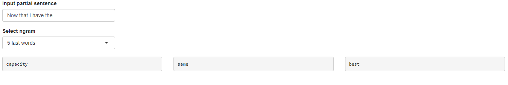
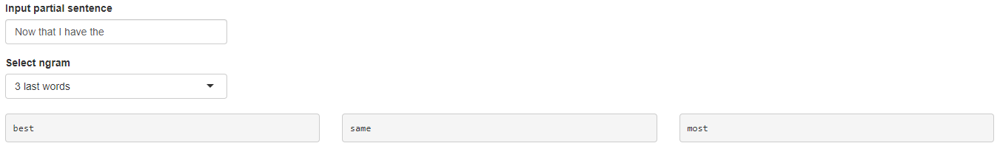
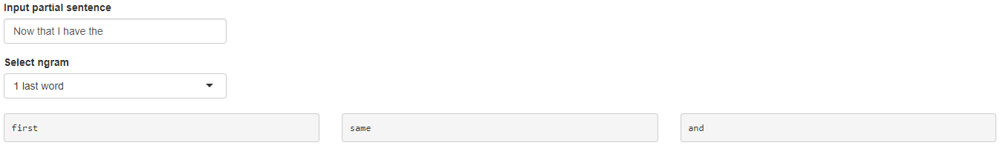

## Executive summary

The main goal of this app is to provide a simple tool that can predict the next word based on a partial sentence input to the system.

The user can:  
> 1. Input a partial sentence and expect an output of the three most probable words  
> 2. Set the number of words it wants to use to predict

--- .class2 #id

## Data

In order to train the predictive algorithm, three corpora of the english language were provided - a corpus (plural - corpora) is a "language resource consisting of large and structured set of texts"([Wikipedia](https://en.wikipedia.org/wiki/Text_corpus)).

The corpora is divided as follows:

> - A text corpus from **news**: +1M lines  
> - A text corpus from **blogs**: ~900k lines
> - A text corpus from **Twitter**: +2.3M lines

--- .class #id

## Algorithm

For building this app, the adopted strategy is as follows:

>1. The app receives inputs - words that the user writes into the provided text-input space;  
>2. Then, based on previous input words (*history*), the algorithm searches in the corpora for the most frequent combinations of *history*, therefore predicting the next words.
To ilustrate: *history* = "I want to go" could be followed by the word "home", depending on the corpora.
>3. Then, the most recent words in *history* ared used to look for others probables combinations.
In our previous example, the algorithm would search for combinations with "want to go", "to go", "go" and finally would look for the most probable word alone. Always discounting previous predicted outputs.
>4. In order to assign probabilities to those predicted outputs for every sequential combination in *history*, the Katz back-off algorithm was used.

--- .class #id

## Example

--- .class #id

## Accuracy

> In order to measure the goodness of the algorithm, part of the corpora was held-out and then the probability of a few sentences calculated.

> The perplexity of the held-out corpora was measured. For some intuition: if we were to predict the next word without any information, the perplexity of this application would be near 150.000 (which is almost the number of unique words in the corpora after some prunning.)

> However, if we were to choose only based on the frequencies of words, but no previous words, the perplexity measured were near ``1,469``. Adding previous words as information makes perplexity even lower. The best found perplexity is ``550``, when using two words as *history* and the blog corpus.

> - For twitter: uni - ``2,029``; tri - ``605``
> - For news: uni - ``1,902``; tri - ``671``

> The app can be accessed [here](https://lucassilvat.shinyapps.io/Next_Word)

